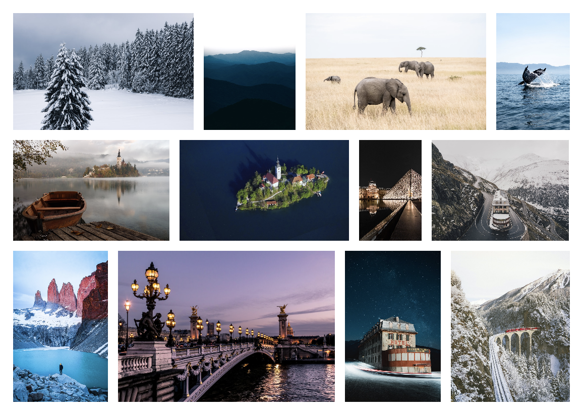

# Cube Gallery

Cube gallery is a justified / Flickr like gallery.



## How to use ?

```js
new CubeGallery(selector, options?).create()
```

#### Example

Create a `div` with your images.
```html
<div id="gallery">
    
    
    ...
</div>
```

Instanciate _CubeGallery_.
```js
new CubeGallery('gallery', {
    minHeight: 150
}).create()
```

## Responsive

Create your gallery like the example above.
```js
let cg = new CubeGallery('gallery').create()
```

Then, create a resize event listener and call resize function from _CubeGallery_.
```js
window.addEventListener('resize', () => {
    cg.resize()
})
```

## Available options

Some options are available to manage your gallery.
```js
{
    minHeight: 100 // default
    margin: 0 // default
}
```